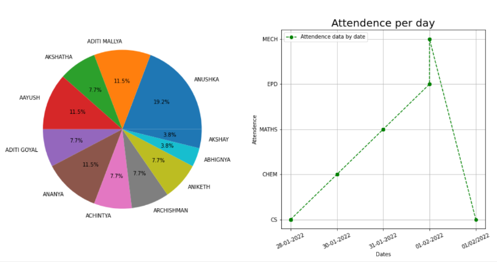
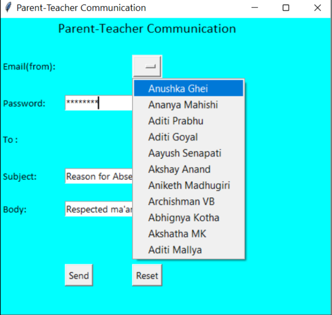

# Student-Attendance-Management
The attendance management system has been designed in order to collect as well as analyse attendance data by making use of facial recognition.
The application detects features of a students face and marks attendance if it finds a match in the existing database of student images in a
particular class. 

Graphs are curated in order to show teachers subject-wise attendance per day and total attendance percentage for each student. 

As an extra feature, this application also enables teachers to directly send emails to students and parents

<h2>Scope:</h2>

The scope of this application is currently limited to the system on which
it is installed, but it can be developed even further to accommodate a
larger sample space of potential users.
A few avenues that could be plausible are :

● A website that can be accessed online or an app that can be installed
in other systems.

● Other methods of attendance marking by using fingerprints or
scanning of barcodes present on the student ID cards.

<h2>Conclusions & Future Enhancements</h2>

The Attendance Management System we have developed using python
meets our objective criteria and performs its designated functions. Using
facial recognition, the power of feature detection, facial encoding and
distance between encodings is harnessed to obtain accurate attendance
data. GUI libraries have been used to provide a user-friendly interface
and enable extra attributes such as graphs and direct email features to
facilitate easy analysis of this data and convenient communication
channels.

There are a plethora of opportunities to develop this project even more in
the future.
We see it being implemented in the form of a website on the university’s
intranet to enable easy and quick access to all faculty for their concerned
classes.
A mobile application is also a good avenue for this solution. An app that
can be installed on students’ phones which is admin protected could be a
future prospect.

We also strive to improve the accuracy of the facial recognition portion
and to eliminate the loopholes to increase the integrity of the data.

<h2>Contributors</h2>
<li>Anushka Ghei</li>
<li>Ananya Mahishi</li>
<li>Aditi Prabhu A</li>
<li>Aditi Goyal</li>
